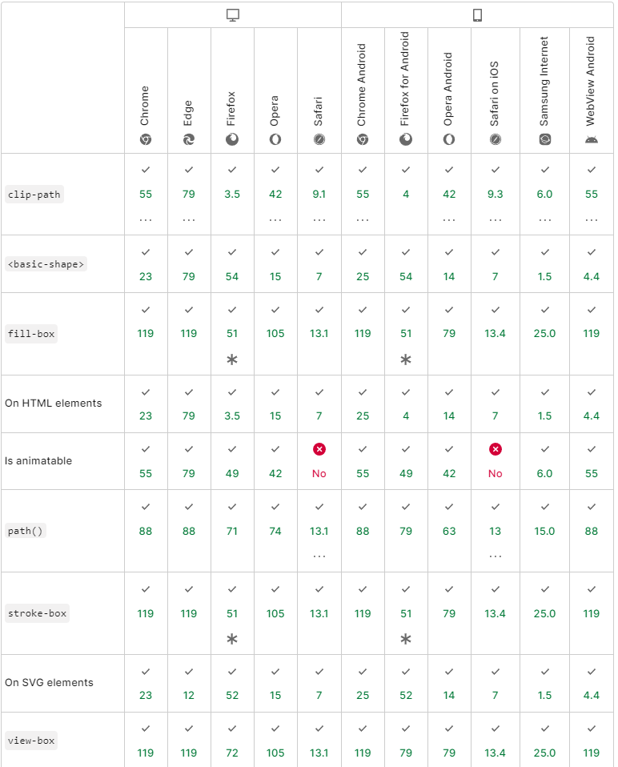

参考
[掘金**CUGGZ** 使用 css 绘制三角形](https://juejin.cn/post/7075884138900750372)
[掘金**Chokcoco** 使用 CSS 轻松实现一些高频出现的奇形怪状按钮](https://juejin.cn/post/7036549260241797134)

## 使用 border 属性

给定一个宽度和高度都为 0 的元素，其 border 的任何值都会直接相交，我们可以利用这交点来创建三角形

```css
.triangle {
  width: 0;
  height: 0;
  border: 100px solid;
  border-color: orangered skyblue gold yellowgreen;
}
```

<br/>
<center>
<div style="
    width: 0;
    height: 0;
    border: 100px solid;
    border-color: orangered skyblue gold yellowgreen;
    "/>
</center>

<br/>

让任何三边的边框的颜色为 `transparent`，则非常容易得到各种角度的三角形;

比如指向下面的三角形，可以让 border 的上边可见，其他边都设置为透明 `transparent`

```css
.triangle {
  width: 0;
  height: 0;
  border-top: 50px solid skyblue;
  border-right: 50px solid transparent;
  border-left: 50px solid transparent;
}
```

以下是实现效果

<div style="display:flex;justify-content: space-between;">

<div>指向下面的</div>

<div>指向左面的</div>

<div>指向右面的</div>

<div>指向上面的</div>

</div>

<div style="display:flex;justify-content: space-between;">

<div style=" 
    width: 0;
    height: 0;
    border-top: 50px solid skyblue;
    border-right: 50px solid transparent;
    border-left: 50px solid transparent;
    border-bottom: 50px solid transparent;
    "></div>

<div style=" 
    width: 0;
    height: 0;
    border-top: 50px solid transparent;
    border-right: 50px solid skyblue;
    border-left: 50px solid transparent;
    border-bottom: 50px solid transparent;
    "></div>

<div style=" 
    width: 0;
    height: 0;
    border-top: 50px solid transparent;
    border-right: 50px solid transparent;
    border-left: 50px solid skyblue;
    border-bottom: 50px solid transparent;
    "></div>

<div style=" 
    width: 0;
    height: 0;
    border-top: 50px solid transparent;
    border-right: 50px solid transparent;
    border-left: 50px solid transparent;
    border-bottom: 50px solid skyblue;
    "></div>

</div>

也可以这样写

```css
.triangle {
  width: 0;
  height: 0;
  border-style: solid;
  border-color: transparent;
  border-width: 50px 0 50px 50px;
  border-left-color: skyblue;
}
```

<br/>
<center>

<div style="
    width:0;
    height:0;
    border-style: solid;
    border-color: transparent;
    border-width: 50px 0 50px 50px;
    border-left-color: skyblue;
  "/>

</center>

通过调整不同方向边框的值来实现不同方向和大小的三角形

```css
.triangle {
  width: 0;
  height: 0;
  border-top: 100px solid skyblue;
  border-right: 100px solid transparent;
}
```

比如

<center>
<div style="
  width: 0;
  height: 0;
  border-top: 100px solid skyblue;
  border-right: 100px solid transparent;
" />
</center>

## 使用 clip-path

clip-path，它是最精简和最可具扩展性的。 不过目前其在浏览器兼容性不是很好，使用时要考虑浏览器是否支持。



使用这个属性其实是相当于把一个矩形对给定点进行切割，浏览器不会绘制 clip-path 之外的任何区域，因此我们看到的是 clip-path 的边界比如下面的代码就是沿 [0 , 0] (左上角) 切割到 [0 , 100%] (左下角) 在切割到 [100% , 50%] (右边中点) 最后在切割回[0 , 0]

```css
.triangle {
  width: 200px;
  height: 200px;
  background-color: skyblue;
  clip-path: polygon(0 0, 0% 100%, 100% 50%);
}
```

<br/>
<center>
<div style=" 
  width: 200px;
  height: 200px;
  background-color: skyblue;
  clip-path: polygon(0 0, 0% 100%, 100% 50%);
"
title="如果要在这样的一个div中放字最好是考虑好位置,因为超出的部分会被裁剪掉"
>如果要在这样的一个div中放字最好是考虑好位置,因为超出的部分会被裁剪掉</div>
</center>

可以使用在线工具来尝试这个属性，绘制不同的图形：[bennettfeely.com/clippy/](https://bennettfeely.com/clippy/)

## 使用 transform

transform 属性允许我们对元素进行变形，这样配合刚刚提到的 clip-path 属性就可以实现各种各样的形状了。但是使用了 transform 之后，标签内的文字也会同样的变形，所以，我们通常使用元素的伪元素去实现造型，这样可以做到不影响按钮内的文字。

### 梯形和平行四边形
